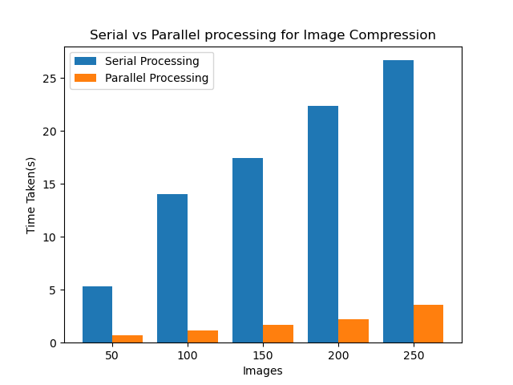

# Serial Vs Parallel Processing for Image Compression

7th Semester Multicore Architecture assignment.

The shift to multicore computing is pervasive throughout most industries, and the image and machine vision industries are no exception. This could improve throughput and reduce response times for camera systems dealing with growing amounts of data. Images are processed using two or more computer cores in multicore image processing. In other words, the processing of a task from an imaging system is shared among numerous cores. Moving to a multicore system has the overall benefit of reducing response time and increasing throughput in an imaging system. Multicore allows users to make use of the latest PC processor designs, allowing algorithms and software to run quicker and perform more tasks. The increasing computational capacity and programmability of multi-core architectures offer promising opportunities for parallelizing image compression and processing methods.

## Team Members

1. Aravind Shreyas Ramesh, 1MS18CS046
2. Dheeraj Bhat, 1MS18CS040
3. Divya, 1MS18CS043
4. Gaurav V, 1MS18CS046

## Assignement Report

View the assignment report [here](https://github.com/Gaurav-71/Multicore-Image-Compression/blob/main/Assignment%20Report.pdf).

## Video Explanation

https://youtu.be/TWYq8GCnWMw

## Results

```
=== Compression Statistics ===

No. of images : 268

Total image size before compression : 276.5 MB
Total image size after compression : 11.4 MB

Serial Compression took 27.824094533920288 seconds
Parallel Compression took 3.9175472259521484 seconds

```



## Installation Steps

`pip install Pillow`

`pip install numpy`

`pip install matplotlib`
